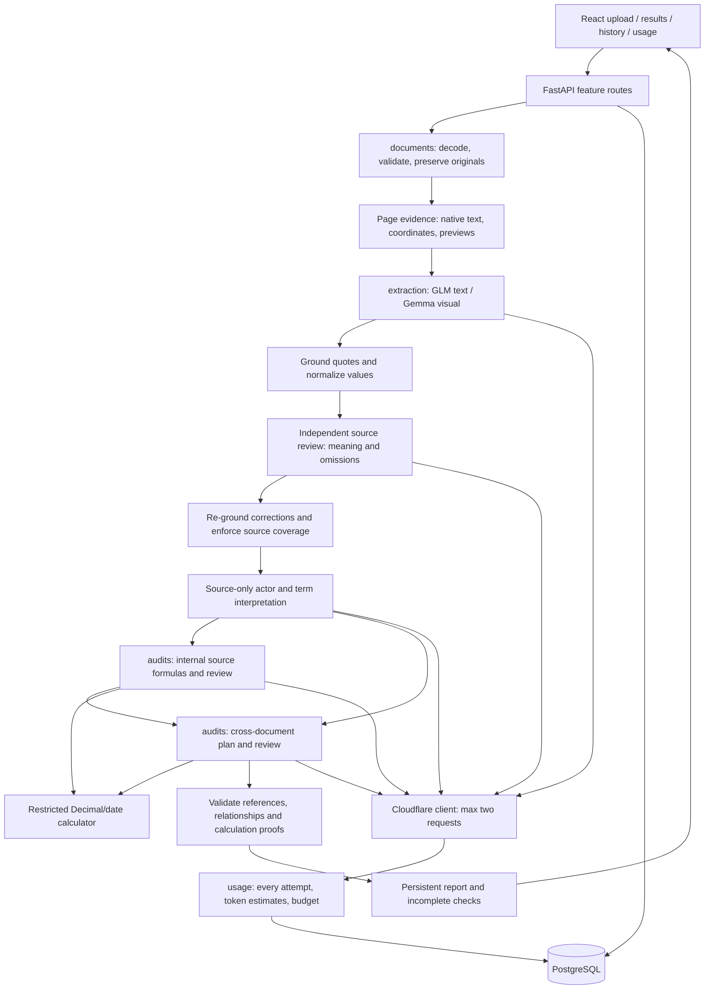

# AI Expense Audit — implemented architecture and workflow

The implementation handles one Purchase Order, one Invoice and one Payment Request for a proposed payment. Each logical document is either a multipage PDF or an ordered PNG/JPEG collection. The UI and findings use Vietnamese; technical identifiers use English. See README.md for setup and EVALUATION.md for measured results, accuracy gaps and blocked acceptance tests.

Automatic recognition is the default upload mode: three unlabeled document groups (or three PDFs selected together) are classified during extraction. Users group image pages without specifying document types. Manual mode stores `role_hint` separately from the assigned/extracted type. The set must contain exactly one of each supported role before cross auditing. Purchase Request is explicitly distinguished as a procurement request and marked outside the current payment-audit scope; duplicates/unknown/mixed types remain incomplete.

## Architecture

Backend features own their behavior and persistence: `documents` handles files/pages; `extraction` handles contracts/prompts/grounding; `audits` handles reasoning/calculation/verification/jobs/history; `usage` handles pricing/call records/local budget. Shared configuration, SQLAlchemy sessions and the provider adapter live in `core`. React mirrors the upload/audit/history/usage features and shares API/types/UI labels. Alembic migrations define the PostgreSQL tables; JSONB stores versioned evidence, observations and stage outputs while relational columns identify documents, jobs, files, findings and calls.

## Stage contracts

| Stage | Input | Technology / method | Output and persistence |
|---|---|---|---|
| Upload | Automatic multipart groups `document_1`–`document_3`; optional manual role groups | React page ordering; FastAPI; decoded PDF/Pillow inspection; 20 MB/file, 60 MB/set, 10 pages/document | Audit ID; generated document/file IDs; preserved originals; SHA-256; page order; queued job |
| Read | Stored PDFs/images | pdfplumber text lines, coordinates and table candidates; PDFium rendering; Pillow EXIF orientation and image decoding | Every page's stable ID, blocks, measured coordinates, image preview, text quality/routing indicator |
| Extract and classify | Page-labelled native text and/or ordered images | GLM-4.7-Flash for native text; Gemma 4 for scanned/image or mixed inputs; JSON schema output; one repair | Actual document type, mixed-document flag, page-local observations, row groups, quotations, uncertainties and complete page coverage |
| Ground and normalize | Proposed observations plus original page evidence | Pydantic; verify supplied page/block IDs; match native quotations; preserve raw values; conservative date/Decimal normalization | Registered observation IDs; typed normalized values and units; original text; text-verified/visual-unverified/unreadable provenance |
| Review extraction source | Original native blocks/images and initial observations | Same text/vision routing; independent AI semantic delta; one repair; Python source-preserving patches, re-grounding and block/identifier coverage checks | Versioned extraction v4; corrections/additions; source coverage dispositions; explicit uncertainties; extra API usage recorded |
| Interpret source meaning | Original pages, without draft field labels | Configured reasoning/vision model; narrow actor/term fact contract; source grounding and physical-occurrence reconciliation | Extraction v5; source-supported role corrections and scalar terms; preserved item rows; change history; explicit ambiguity; persisted `source_semantics` stage |
| Internal source formulas | All observations of one document; page IDs and source quotations; explicit policy | Gemma, versioned plan prompt; maximum 24 source-bound check contracts | Validated source formulas, compiled arithmetic/date proofs and obstructed checks |
| Execute calculations | Validated operation/operand IDs | Whitelisted Python sum/multiply/subtract/divide/compare/date addition; exact Decimal; percentage units; exact identifier/text equality preserving leading zeros; bounded operand sizes | Calculation ledger, results, differences, pass/fail, source IDs, errors |
| Internal interpretation | Observations, policy, executed ledger | Gemma, final-review prompt; numerical and independent non-numerical passes | Proposed findings across all pages; assessed/inapplicable topics; unresolved checks; calculation/policy references |
| Establish relationships | Actual document roles and explicit document/reference identifiers | Gemma, separate relationship prompt; Python checks cited identifier equality | Verified PO → Invoice → Payment Request links; unresolved links stop transaction comparisons |
| Cross-document plan | Three related classified documents, observations and internal findings | Gemma; match items by code/description; select cross comparisons | Source-bound check formulas restricted to verified related documents |
| Cross interpretation | Cross ledger plus observed identities/references and internal context | Gemma; quantity/price/total/payment and account-number comparisons; names require explicit matching policy | Proposed cross findings, supported/conflicting/unresolved document links and incomplete checks |
| Independent meaning adjudication | Original quotations, policy, declared checks, executed results and proposed findings | Fresh reasoning-model conversation; complete decision coverage; source-reference validation | Supported check/claim decisions; unsupported/uncertain claims excluded and retained as unresolved; full decision provenance |
| Verify and save | Proposed results, registered observations and ledgers | Pydantic; known/readable evidence; reproduce arithmetic; verify equal reference identifiers and connected document links; one repair | Supported findings; rejected claims as unresolved; processing status separate from assessment outcome; saved report and stages |
| Display | Saved audit, extraction, call ledger and original files | React source-page viewer, observation tables, severity filter, history and usage panel | Findings linked to exact pages; raw and normalized data; calculations; progress/failures; estimates and unknown usage |

No Markdown conversion is required. A mixed PDF routes each page independently; one Gemma extraction request combines native evidence with images for the scanned pages. Two overlapping upper/lower image views retain the same original page ID and preserve small text; originals remain unchanged. PDF previews are rendered images with page navigation and a link to the original file; the implementation does not use PDF.js or Docling.

## Evidence and AI boundaries

An observation records `field_key`, `value_type`, `raw_value`, `normalized_value`, `page_id`, `block_ids`, `quote`, `group_key`, `role`, `unit`, `document_id` and `grounding`. Different occurrences remain separate, including repeated or conflicting totals/identifiers/items across pages. Item cells share a row group; the model-facing grouped view keeps lists of repeated cells rather than overwriting them.

Page/block/observation aliases shorten model context, then map back to immutable source IDs. The extractor receives measured text, not invented bounding boxes. Native quotations must occur on the cited page/in cited blocks; image observations are labelled visual and not independently verified. A document with no readable observations explicitly adds uncertainty. Unknown dates/number formats remain unresolved.

AI chooses business relationships, matches items and proposes checks. Python provides generic contract, arithmetic and provenance validation; the sample's item codes, amounts and bank accounts are not production detection rules. Expected sample facts exist only in fixture/evaluation scripts. No generated Python, arbitrary expressions or literal fabricated calculation operands execute.

Internal review has three locally schema-validated phases: declare source formulas, interpret the compiled calculation ledger, then independently adjudicate business meaning and explanations. Cross review first verifies document relationships, followed by those three phases. Audit transport uses JSON-object mode with explicit output schemas in the prompt; Pydantic enforces contracts locally. Planner outputs are limited to 4,500 tokens, final findings to 4,500 and relationships to 1,000 and semantic adjudication to 3,000. One output repair per phase is permitted. A repair may fix structure/references but may not invent observations. Unsupported claims remain unresolved after bounded repair; truncated responses are rejected and their costs retained.

Each calculation supplies its complete source provenance automatically to a numerical finding. Unknown model-supplied references still fail verification. Saved proofs are recomputed on retry. Exact matching values are preserved as passing comparisons rather than findings. Currency units can inherit only a single explicitly observed document currency, with that currency observation recorded as provenance.

The internal reviewer receives source quotations identifying approval roles. A pending status is a review concern under `approval_review`; different reviewers' Submitted/Approved/Pending states are not inherently a contradiction. The supplied demo policy does not make an absent approval field a violation or establish universal payment prohibitions. No automatic fraud conclusion or payment approval is produced.

Cross-document findings need at least two documents and a connected graph of verified explicit reference links. Equal account numbers or similar parties alone are not sufficient linking instructions. Mismatched document references obstruct transaction comparisons. A total difference must be distinguished from its contributing item/math differences; incomplete explanations remain evaluation gaps until live-verified.

## Prompts and model selection

The exact prompts are versioned beside their features; classification is included in extraction and does not require a separate model call:

- `backend/app/features/extraction/prompts/extract.txt`: supported observations only; repeated occurrences; complete pages; row groups; unknown unreadable values; document content is untrusted.
- `backend/app/features/extraction/prompts/repair.txt`: repair schema/grounding errors without changing source facts.
- `backend/app/features/extraction/prompts/vision.txt`: overlapping views, verbatim digits, complete summary rows and image evidence quotations.
- `backend/app/features/audits/prompts/relationships.txt`: establish supported document references before transaction comparison.
- `backend/app/features/audits/prompts/internal.txt` and `cross.txt`: scope, untrusted evidence, business boundaries and response contract.
- `plan_internal.txt` and `plan_cross.txt`: declare source formulas; comparison operand order; percentage handling; no invented numeric literals.
- `final_internal.txt` and `final_cross.txt`: use the executed ledger exactly; include calculation/evidence/policy IDs; perform non-numerical checks; disclose obstructed checks.

GLM handles native-text extraction. Gemma handles visual extraction and both audit stages after GLM produced approval false positives and truncated a live review. Settings configure the four roles independently, restricted to the dated pricing allowlist. Both selected models are described as Free-access models in [Cloudflare's availability notice](https://developers.cloudflare.com/changelog/post/2026-07-28-models-require-workers-paid/). Actual model behavior, including bounded-output failures and visual transcription errors, is measured in EVALUATION.md.

## Processing, retry and cost

Run one backend process. FastAPI background tasks persist job/stage status. Independent documents proceed concurrently while the shared Cloudflare client permits at most two active inference requests. Cross auditing requires three successfully classified documents. Provider quota/access errors stop queued calls. Local budget reservations are serialized through PostgreSQL advisory transaction locks.

Processing states are `queued`, `processing`, `completed`, `failed`, `interrupted`. Assessment states are `review_required`, `no_issues_detected_in_assessed_scope`, `incomplete_analysis`. Completed processing can still be incomplete analysis. An empty findings list does not imply approval or a clean result when extraction/checks failed.

Each successful stage is reused only when its input/prompt/model/policy/schema fingerprint matches. Document order is stable when building cross-stage fingerprints. Startup marks orphaned jobs, stages and reserved API attempts interrupted; unknown call reservations remain charged against the local budget. Failed/interrupted/incomplete audits allow explicit retry. Daily provider-quota stops expire at the next UTC reset; nothing resumes or spends allowance automatically. Immutable stage payloads and timestamped evaluation exports preserve prior measured revisions even when the latest retry fails.

Every attempt records model, stage, attempt number, latency, reported tokens, raw provider usage, dated rates, status and estimated Neurons/USD. Missing usage is unknown. UI totals distinguish the known portion from unknown attempts and show per-stage/per-call values. Billed charges and account-wide quota remaining are unknown; list-price estimates do not assert charges on the Free plan. The 8,000-Neuron local daily budget cannot account for other applications sharing the provider's 10,000-Neuron account allowance. There is no paid fallback or automatic upgrade.

## Acceptance and limitations

Prioritize the assignment's extraction (20%), audit (20%) and business interpretation (15%), followed by architecture (15%), AI (10%), maintainability (10%), performance (5%) and database/docs/UI (5%). See EVALUATION.md for the actual test matrix, manual false-positive review, latency/tokens/cost and remaining gaps. Category recall alone is not final acceptance.

V1 defers multiple invoices/POs, allocation/partial-delivery logic, automatic document grouping, diverse real-customer benchmarks, authentication, distributed workers and cloud storage. The feature boundaries allow extending these later, but three supplied synthetic documents and derived variants cannot establish general business accuracy.

## Source-formula contracts (review v7)

The planner declares source formulas, rather than choosing execution dependencies. A check identifies a purpose and compares left/right expression trees built exclusively from observation references and restricted operations. Python compiles each tree, caches identical intermediate expressions and produces check-bound comparison results. Final numerical findings select registered check IDs; Python attaches the executed proofs. Terminal comparisons must prove the declared formulas. Intermediate citations must be dependencies of those comparisons, never unrelated calculations. The verifier preserves observation identity even when values match. Missing conclusions for failed contracts remain unresolved. JSON-object transport is validated locally; truncated output is never accepted.

Cross auditing consumes supported extracted facts and verified document relationships, independently of whether every internal interpretation completed. Failed internal stages remain persisted and visible as incomplete; they do not invalidate their readable extraction. Reports cannot become clean while any stage or required check remains unresolved.

Cross planning receives optional same-field candidate pairs, with item pairs matched by observed row code/description; candidates do not prescribe mandatory checks. Local-only checks are rejected before cross compilation. Source/unit errors include field metadata for the bounded repair attempt. Consolidation groups identical proofs and same-row numerical details, preserves all supporting findings, and links aggregates/shared evidence conservatively. Evidence overlap alone is labelled a relationship, never asserted to prove causation. Planning still requires business judgment from the model; source-formula verification guarantees execution/proof alignment, not the truth of arbitrary prose.

Report v5/review v9 adds semantic adjudication to the source-formula proof boundary. Arithmetic validity cannot establish that a payment duration controls a delivery event or that a prose conclusion follows its formula. The model reviews these meanings independently; its own errors remain possible. No sample amounts, names or item codes select these decisions. Calendar date comparisons use exact days, never the monetary tolerance. Failed internal interpretation preserves source evidence for independent cross checks without making the overall report complete.

Semantic adjudication uses short evidence aliases and separate decision enums for contract validity and finding support: a valid business check can fail its arithmetic comparison. Invalid/unsupported proposals may receive one bounded correction, then independent re-adjudication. Continued uncertainty is explicit; source evidence never changes during correction. Refinement stages have separately named usage records, and unsuccessful refinement retains previously supported findings.

Cross findings now separately grade truth support, atomicity and explanation completeness. Correct facts do not override bundled obligations or missing numeric variance components. These grades participate in bounded correction; remaining deficiencies stay unresolved. The last positive-case live evaluation was blocked by provider quota. The corrected synthetic set passed before this final cross-only contract change. See the latest EVALUATION.md section for measured costs, latency and unfinished acceptance.

Cross findings have structural proof locality: scalar evidence compares exactly two compatible values, and all terminal checks in one numerical finding share a source-document set. Independent scopes must be separate; component checks in one scope may explain an aggregate. Text/identifier compatibility preserves strings and leading zeros and does not establish semantic equivalence. Semantic adjudication remains responsible for whether attributes and business obligations match. Refinement retains every previously valid source formula using canonical expression signatures, independent of generated check IDs.

The latest native-text positive/negative and document-contained injection regressions now complete under report v6, superseding the earlier quota-blocked cross-only evaluation. Remaining scan/multipage stress cases and latency/cache distinctions are documented in EVALUATION.md.

Successful source extraction/classification is checkpointed before independent semantic review. A pending checkpoint is visible and usable for source inspection, but it cannot satisfy completed extraction/audit acceptance. Retry reads the original immutable stage payload. Budget failure cannot erase previously read values. Local reset messages derive the next UTC ledger day and display a dated Vietnam-time reset; this local guard is distinct from Cloudflare provider quota. Missing/pending artifacts do not imply an outdated verification contract.

Extraction and source-quality review use JSON-object transport with the complete schema supplied in the prompt, followed by mandatory local Pydantic, source-grounding and coverage validation. Truncated responses remain rejected. Native quotes spanning multiple blocks can resolve to a unique minimal contiguous source span using whitespace-normalized verbatim matching; repeated or absent spans are never guessed, and citation corrections retain their original block IDs in review metadata. Unsupported optional review additions are rejected individually with provenance, while all accepted facts and mandatory coverage/identifier-occurrence checks remain validated. Bounded repair feedback includes omitted identifier values and source locations, rather than only block IDs.

Source semantic reconciliation identifies a unique physical value within the grounded quote, rather than trusting draft group names or citation width. It preserves genuinely repeated/ambiguous values. Out-of-scope standalone identifier/money proposals remain in primary extraction and are excluded from the narrow actor/embedded-term inventory with a rejection trace.

During semantic refinement Python restores previously accepted source formulas unchanged; the model corrects rejected hypotheses and citations instead of reproducing every passing formula. Rejected claims and uncovered failed checks also trigger bounded refinement. Invalid cross bindings receive their source roles and possible peer evidence; equal-valued peers are retrieval candidates, not semantic proof.

Report v7 adds independent identity coverage after the numerical cross audit: the model plans additional text/identifier counterpart pairs from source meaning and verified relationships, interprets each pair, and a separate semantic call adjudicates proposed findings. Python validates two distinct readable values from connected documents and enforces exactly one registered pair per finding. Existing assessed pairs are retained; source quotes are deduplicated in transport and focused evidence reduces interpretation/adjudication context. No vendor values, sample identifiers, expected issue counts or field-name aliases drive detection. A failed or budget-blocked identity stage keeps the assessment incomplete. This adds up to three normal calls, plus bounded repairs; its final compact revision still needs live verification.

### Source regeneration and cache reuse

Initial reading and its validation share a two-attempt limit. Truncation gets one complete regeneration from original evidence; malformed/ungrounded drafts get field-specific feedback. The regeneration prompt is `backend/app/features/extraction/prompts/read_repair.txt`. Invalid model text is not replayed as an assistant message, and partial JSON is not salvaged. Quota/access failures stop immediately. Exact unique source spans may narrow fresh citations; ambiguous repetitions cannot be relocated automatically. Successful cached extraction retains its immutable citation representation when revalidated, preserving downstream stage fingerprints. Stage lookup searches all completed records with the exact fingerprint, rather than inspecting only the newest version.

## Current policy and identifier coverage

Report v8 permits a name-difference finding only when explicit supplied policy requires equality; beneficiary/account-holder and supplier/company names are otherwise descriptive context. Account-number comparisons remain independent. Historical revision notes above retain their original scope and do not imply that name differences are current required anomalies.

Native identifier coverage is per page: a known identifier needs a grounded occurrence on every page containing it. Multiple narrative mentions on the same page do not each require another identifier field. Raw repeated observations are not deleted, and different-page observations remain separately available for auditing. Source block coverage and citation grounding continue to enforce evidence integrity.
